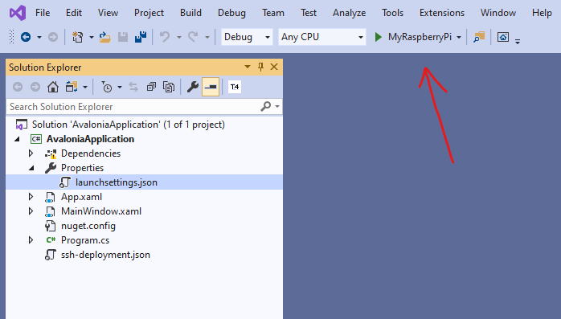

# SSH Deployer
Deploy your .NET Project to Raspberry Pi / Linux x64 with ease!
This will help you deploy your NET Core applications (Console or ASP.NET) to Raspbian or other Linux distro in the blink of an eye. 


# Requirements

- Linux device: Currently supported Raspberry Pi (Linux ARM) and generic Linux x64 distros.
- [.NET Core 3.0+](https://www.microsoft.com/net/download)
- SSH enabled on your target machine

# Installation
- Open a command prompt
- Run `dotnet tool install --global dotnet-ssh`
- You're ready to go!

# How do I deploy my application?
Follow these steps :) It's super easy to do it!

## 1. Configure a deployment profile

You need to configure a deployment profile first:

1. Go to the root directory of the project you want to deploy
2. Run this command depending on the authentication method you want to use to access the remote machine. **The "User Secrets" method is recommended**.

* ### User Secrets
```
dotnet-ssh configure MyRaspberryPi --auth-type UserSecrets --auth username:password
```
This authentication method will use User Secrets to store your login in a safe storage inside your computer.

* ### Private SSH key (experts-only 😁)
```
dotnet-ssh configure MyRaspberryPi --auth-type PrivateKeyFile --auth username:pathToPrivateKeyFile
```
This authentication method uses a private SSH key file. You can generate one with [PuTTY](https://stackoverflow.com/a/2224204/1025407) or inside your GNU Linux distro using the [ssh-keygen](https://www.ssh.com/ssh/keygen) tool.

* ### Classic (unsafe)
```
dotnet-ssh configure MyRaspberryPi --auth-type Classic --auth username:password
```
#### WARNING: 
The **classic method** of authentication writes your login information in `launchsettings.json`, that is inside your project folder. Please, use it with caution. If you share the solution or push it to an online repository, your credentials will be publicly visible.

## 2. Deploy your application

1. After you've configured the profile, go to Visual Studio and open the solution you want to deploy. 
2. Set the project you want to deploy as startup project. 
3. In the launch settings dropdown (the one that is pointed by an arrow in the snapshop below) you'll see that your profile has been added. In case it hasn't been selected automatically, select it manually.

2. Run the app by clicking on the **play button** or pressing **F5**
3. Your application should be deployed to the remote system. The application will also be executed if you have configured to do so. This is enabled by default.

# Requirements for the remote machine
Before you run the application, you must ensure your remote device has the appropriate version of the .NET Core runtime installed.

For convenience, I've added the instructions to install v2.1 for Raspbian.
## Installing .NET Core 2.1 for Raspbian

Execute the following commands inside a terminal
```
sudo apt-get -y update
sudo apt-get -y install libunwind8 gettext
wget https://dotnetcli.blob.core.windows.net/dotnet/Sdk/2.1.300/dotnet-sdk-2.1.300-linux-arm.tar.gz
wget https://dotnetcli.blob.core.windows.net/dotnet/aspnetcore/Runtime/2.1.0/aspnetcore-runtime-2.1.0-linux-arm.tar.gz
sudo mkdir /opt/dotnet
sudo tar -xvf dotnet-sdk-2.1.300-linux-arm.tar.gz -C /opt/dotnet/
sudo tar -xvf aspnetcore-runtime-2.1.0-linux-arm.tar.gz -C /opt/dotnet/
sudo ln -s /opt/dotnet/dotnet /usr/local/bin
dotnet --info
```

## Installing .NET Core in other Linux distros

Refer to https://dotnet.microsoft.com/ for download and install instructions 🐔
